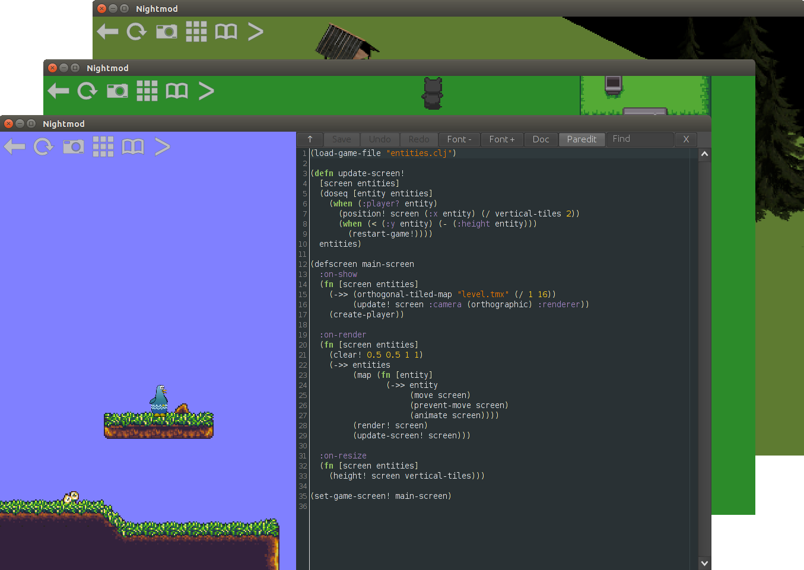

## Introduction

Nightmod is a tool for making live-moddable games. You can view a game's code while it's running and inject changes by simply hitting "Save". With the powerful Clojure programming language, you'll see your game come to life as you type. Please see [the website](https://nightmod.net) for more details.

## Getting Started

* Read [the tutorial](TUTORIAL.md)
* Try all the built-in templates
* Try more examples:
    * [2D Physics](https://gist.github.com/oakes/ee8882f009dbde17f4e1)
    * [3D Physics](https://gist.github.com/oakes/51f672f4124e725cd4b7)

## Licensing

All files that originate from this project are dedicated to the public domain. I would love pull requests, and will assume that they are also dedicated to the public domain.
